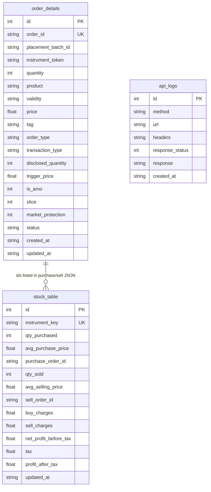

# Models package + Alembic setup

## Scope

Two focused deliverables:

1. **Separate models directory** — SQLModel `table=True` classes for `order_details`, `stock_table`, `api_logs` under `src/db/models/` (not next to API DTOs).
2. **Alembic setup** — init + configure so migrations target the same SQLite file as `DB_PATH`, then create and apply the first revision on **demo**.

No wiring into `place_order` / `modify_order` yet. Keep `../DTO/order_dto_deprecated.py` as HTTP-only Pydantic models.

## Schema (committed)



- **`order_details`**: one row per Upstox `order_id`; shared `placement_batch_id` when place returns multiple ids.
- **`stock_table`**: one row per `instrument_key`; `purchase_order_id` / `sell_order_id` as JSON text arrays.
- **`api_logs`**: method, url, headers, response_status, response, created_at.

---

## Part A — Models in a separate directory

Layout under `src/db/` (alongside existing `src/db/helper/db_connector.py`):

```
src/db/
  helper/
    db_connector.py
  models/                 # NEW package — persistence only
    __init__.py           # re-export OrderDetail, Stock, ApiLog
    order_detail.py       # OrderDetail → order_details
    stock.py              # Stock → stock_table
    api_log.py            # ApiLog → api_logs
```

Rules:

- Each table = one module under `src/db/models/`.
- Classes use `SQLModel, table=True` with explicit `__tablename__`.
- `UNIQUE` on `order_id` and `instrument_key`; qty/charges default `0`; timestamps as ISO `str`.
- `__init__.py` imports all models so `from db.models import OrderDetail, Stock, ApiLog` works and Alembic can register metadata via one import of the package.

---

## Part B — Alembic setup

Follow `db_readme.md`; nothing exists yet (`alembic/` not in repo; deps missing from `pyproject.toml`).

### B1. Dependencies

```bash
uv add sqlmodel alembic
```

### B2. Init

From repo root:

```bash
uv run alembic init alembic
```

Creates `alembic.ini` and `alembic/` (including `env.py`, `script.py.mako`, `versions/`).

### B3. Configure `alembic.ini`

- `script_location = alembic`
- `prepend_sys_path = src` (so `db.models` imports resolve like `main.py`)
- Do not hardcode `sqlalchemy.url` in the checked-in ini

### B4. Configure `alembic/env.py`

- Resolve env via `UPSTOX_ALEMBIC_ENV` (default `demo` → `sandbox.env`, `prod` → `prod.env`)
- `load_dotenv` from `src/env/...`; build `sqlite:///{src}/{DB_PATH}`; `mkdir` parent
- `from db.models import OrderDetail, Stock, ApiLog` (registers on `SQLModel.metadata`)
- `target_metadata = SQLModel.metadata`
- `render_as_batch=True` for SQLite-friendly alters
- **Never** import `helper_func.config` (requires `--env`)

### B5. First migration + apply (demo)

PowerShell from repo root:

```powershell
$env:UPSTOX_ALEMBIC_ENV="demo"
uv run alembic revision --autogenerate -m "create order_details stock_table api_logs"
```

Review `alembic/versions/` (three `CREATE TABLE`s). Then:

```powershell
$env:UPSTOX_ALEMBIC_ENV="demo"
uv run alembic upgrade head
uv run alembic current
```

Confirm tables in demo DB (`DB_PATH` from sandbox, typically `src/db/data/trades.db`).

---

## Docs

Update `db_readme.md` to document `src/db/models/` and the real Alembic layout (replace placeholder `Trade` example).

## Out of scope

- Integrating inserts into `src/helper_func/order_helper.py`
- Prod migrations
- Junction tables for order ids
